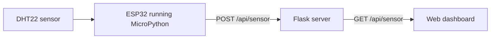

# MicroBreathe

MicroBreathe is a small indoor-climate monitor built with an ESP32, a DHT22
temperature and humidity sensor, and a Flask web dashboard. The ESP32 sends a
reading to the Flask server every five seconds, while the dashboard fetches the
latest reading every two seconds.



## What you need

### Computer

- Python 3
- A computer and ESP32 connected to the same local network
- A web browser

### Hardware

- ESP32 development board
- DHT22 temperature and humidity sensor
- Jumper wires
- USB cable for power and programming

## Project structure

```text
MicroBreathe/
├── app.py                # Flask server and sensor API
├── esp32.py              # MicroPython program for the ESP32
├── requirements.txt      # Python dependencies for the server
└── templates/
    └── index.html        # Browser dashboard
```

## 1. Set up the Flask server

Clone the repository and enter its directory:

```bash
git clone https://github.com/KitCJX/MicroBreathe.git
cd MicroBreathe
```

Create and activate a virtual environment:

```bash
python3 -m venv .venv
source .venv/bin/activate
```

On Windows PowerShell, activate it with:

```powershell
.venv\Scripts\Activate.ps1
```

Install the dependencies:

```bash
python -m pip install -r requirements.txt
```

Start the server:

```bash
python app.py
```

Open <http://127.0.0.1:5001> on the server computer. The cards display `--`
until the server receives its first sensor reading.

## 2. Find the server's local IP address

The ESP32 must use the server computer's local network address, not
`127.0.0.1`.

On macOS, this command usually prints the Wi-Fi address:

```bash
ipconfig getifaddr en0
```

On Windows, run `ipconfig` and look for the Wi-Fi adapter's **IPv4 Address**.
On Linux, run `hostname -I`.

For example, if the address is `192.168.1.25`, the sensor endpoint is:

```text
http://192.168.1.25:5001/api/sensor
```

## 3. Connect the DHT22

Follow the labels on your sensor or module; pin order can vary.

| DHT22 connection | ESP32 connection |
| --- | --- |
| `VCC` or `+` | `3.3V` |
| `DATA` or `OUT` | `GPIO 16` |
| `GND` or `-` | `GND` |

For a bare DHT22, connect a 10 kΩ pull-up resistor between `VCC` and `DATA`.
Many three-pin DHT22 modules already contain this resistor.

## 4. Configure and upload the ESP32 program

Install MicroPython on the ESP32, then edit these values near the top of
`esp32.py`:

```python
WIFI_NAME = "YOUR_WIFI_NAME"
WIFI_PASSWORD = "YOUR_WIFI_PASSWORD"
SERVER_URL = "http://192.168.1.25:5001/api/sensor"
```

Replace the example IP address with the Flask server's local IP. Keep the
computer and ESP32 on the same network.

Upload `esp32.py` to the ESP32 as `main.py` so MicroPython runs it at startup.
The firmware must provide either the `requests` or `urequests` module used to
send HTTP requests.

After the board restarts, its serial output should show the Wi-Fi connection,
sensor values, and an HTTP `200` response. Refresh the dashboard if the readings
do not appear immediately.

## Test without an ESP32

With the Flask server running, send a sample reading from another terminal:

```bash
curl -X POST http://127.0.0.1:5001/api/sensor \
  -H 'Content-Type: application/json' \
  -d '{"temperature": 26.4, "humidity": 58.2}'
```

Then inspect the stored reading:

```bash
curl http://127.0.0.1:5001/api/sensor
```

The dashboard should show `26.4 °C` and `58.2 %`.

## API

| Method | Endpoint | Purpose |
| --- | --- | --- |
| `POST` | `/api/sensor` | Replace the latest temperature and humidity reading |
| `GET` | `/api/sensor` | Return the latest reading as JSON |
| `GET` | `/` | Open the dashboard |

Example request body:

```json
{
  "temperature": 26.4,
  "humidity": 58.2
}
```

Example response from `GET /api/sensor`:

```json
{
  "humidity": 58.2,
  "temperature": 26.4
}
```

## Troubleshooting

- **The dashboard still shows `--`:** confirm the ESP32 reports HTTP `200`,
  verify `SERVER_URL`, and try the `curl` test above.
- **The ESP32 cannot reach the server:** confirm both devices are on the same
  network, use the computer's local IP address, and allow incoming connections
  to Python through the computer's firewall.
- **The sensor reports errors:** check power, ground, the GPIO 16 data wire, and
  the required pull-up resistor.
- **Port 5001 is already in use:** stop the process using that port or change the
  port in both `app.py` and `SERVER_URL`.
- **Readings disappear after a restart:** the current server keeps only the
  latest reading in memory. It does not save readings to a database or file.

## Current limitations

- The API has no authentication and is intended for a trusted local network.
- Flask debug mode is enabled for development; do not expose this server
  directly to the public internet.
- Only the latest reading is stored, and it is cleared whenever the server
  restarts.
- The dashboard does not yet display history, charts, alerts, or multiple
  sensors.
